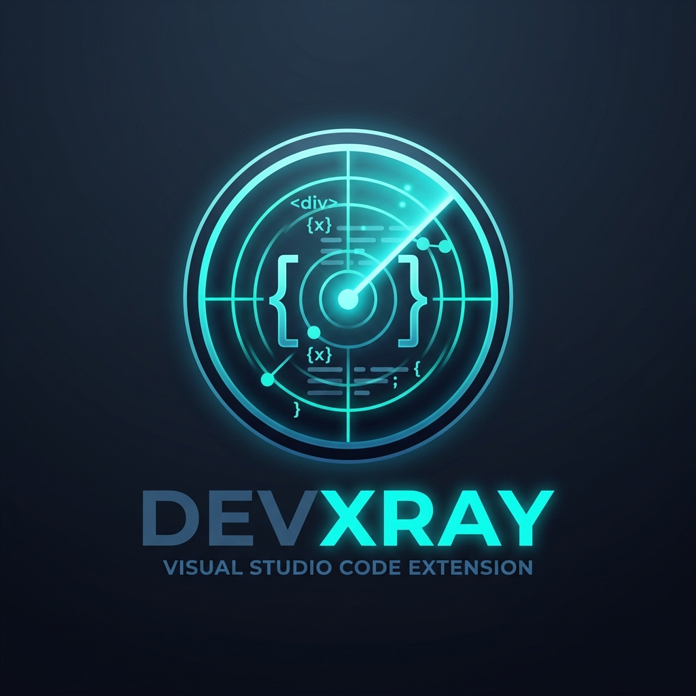

# DevXray: The Developer's Second Brain 🧠

**DevXray** is a powerful VS Code extension that gives you a living, intelligent map of your entire codebase. It analyzes your project structure, detects code health issues, surfaces dependency risks, and answers natural language questions using AI—all from within your editor.

## Features

### 🗺️ Codebase Explorer
Visualizes your project as a dependency graph. Quickly see exactly which files, classes, and functions rely on each other without having to grep through imports. 

### 🧹 Dead Code Hunter
Finds code that exists but is never used anywhere in your project. Detects unused exports, orphaned functions, and files with zero inbound imports.

### 📦 Dependency Detective
Analyzes your `package.json` dependencies against the live npm registry. Instantly highlights outdated packages and shows you exactly how many files in your project actually depend on them.

### ⚡ Performance Analyzer
Live static analysis detecting common JavaScript/TypeScript performance anti-patterns, including:
- `await` inside loops (causing waterfall requests)
- Deeply nested loops
- Synchronous blocking calls (`readFileSync`) inside `async` contexts

### 🤖 Ask DevXray (AI Assistant)
Ask natural language questions about your codebase. DevXray intercepts the prompt and automatically injects a highly compressed, structured graph of your entire workspace as context. 
- **Provider Agnostic**: Supports OpenRouter or local models via Ollama/LM Studio.

### 📊 Project Health Dashboard
A beautiful, real-time dashboard giving your project a 0-100 Health Score based on performance anti-patterns, dead code, and dependency freshness.

## Setup & Configuration

Configure DevXray in your VS Code settings (`cmd + ,` -> search `DevXray`):

- **AI Provider**: `devxray.ai.provider` (`openrouter` or `local`).
- **Model**: `devxray.ai.model` (e.g. `openai/gpt-4o-mini`).
- **API Key**: `devxray.ai.apiKey` (If using OpenRouter).
- **Local Endpoint**: `devxray.ai.localEndpoint` (Defaults to `http://127.0.0.1:11434/v1/chat/completions`).

## Getting Started

1. Open a workspace folder in VS Code.
2. Click the **DevXray** icon in the Activity Bar.
3. Click **Analyze Project** to build the initial codebase graph.
4. Explore the panels or open the command palette (`Cmd+Shift+P`) and type `DevXray` to see available commands!

## License
MIT License. Created by [saswat](https://github.com/saswat).
